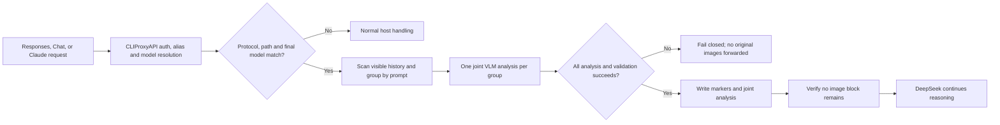

<div align="center">

# deepseek-vision

### Reliable image understanding for text-only DeepSeek models in CLIProxyAPI

`deepseek-vision` is a native **CLIProxyAPI v7** request-preprocessing plugin. It uses a vision model already available
through the host, turns all images in one prompt into a joint visual analysis, and lets DeepSeek continue with text.
An Agent can also revisit the same image with a new focus and obtain a fresh task-specific analysis.

[](https://github.com/Zesuy/Plugin-Deepseek-Vision/releases)
[](https://github.com/Zesuy/Plugin-Deepseek-Vision/actions/workflows/ci.yml)
[](https://go.dev/)
[](https://github.com/router-for-me/CLIProxyAPI)
[](https://github.com/router-for-me/CLIProxyAPI-Plugins-Store)
[](docs/limitations.md)
[](LICENSE)

[简体中文](README.md) · **English** · [Official plugin source](https://github.com/router-for-me/CLIProxyAPI-Plugins-Store) · [Installation](docs/installation.md) · [Configuration](docs/configuration.md) · [Troubleshooting](docs/troubleshooting.md)

</div>

---

Text-only DeepSeek models cannot consume `input_image` blocks from OpenAI Responses requests. After CLIProxyAPI has
completed authentication, alias resolution, and final-model selection, this plugin asks a vision model to understand
the images and replaces them with plain-text analysis. DeepSeek receives the original task plus the
visual information, but never receives image blocks it cannot read.

> [!IMPORTANT]
> This is not another proxy, model provider, or protocol-conversion layer. The plugin has no extra endpoint or API-key
> setting. CLIProxyAPI continues to own model routing, credentials, protocol translation, transport, retries, and
> provider rate-limit policy.

## What v0.3.1 provides

| Capability | Behavior |
| --- | --- |
| **Controlled Agent reanalysis** | An Agent can revisit the same image with a new focus through declared `view_image` / `deepseek_vision_reanalyze` rich tool output |
| **Ordered vision fallback** | Tries `vision_model` and `vision_fallback_models` in order and returns safe, distinguishable attempt summaries on failure |
| **Native host execution** | Reuses CLIProxyAPI `host.model.execute`, routing, and credentials without another endpoint or API key |
| **Three protocols and multi-image context** | Supports Responses, Chat, and Claude while jointly analyzing ordered images from one prompt |
| **Explicit cache semantics** | Ordinary requests may reuse derived results; focused analysis supports `refresh`, `no_store`, and idempotent call-ID replay |

## In action

| Cross-turn image context and model switching | Front-end diagnosis from a screenshot |
| --- | --- |
|  |  |
| After switching to `deepseek-v4-flash`, historical images are converted into visual context before the target model runs. | The vision model identifies the table, button groups, and wrapping; DeepSeek can then continue into the relevant CSS. |

### A focused second look at the same image


The first pass answered questions about the page structure and icons. The user then asked specifically about typography
and the color of the mirror-sync indicator. The Agent invoked `view_image` for a task-specific analysis and recovered
details that the broad first pass had not covered instead of reusing the old result.

These are real sessions. In same-host A/B probes with these images, the task-focused prompt
and low-reasoning vision request reduced the VLM stage from 27.8s to 7.4s and from 49.1s to 16.6s while retaining
automatic image detail. `detail=low` was faster but omitted small text and the security alert, so it was rejected.

## How it works



Three screenshots attached to one prompt normally produce one vision-model call. Their order and up to 2,000
characters of associated prompt text are preserved so the VLM can explain each image, transcribe visible text, and
describe relationships between them. The rewritten item resembles:

```text
[Image 1 — already analyzed; the target model cannot read this attachment directly]
[Image 2 — already analyzed; the target model cannot read this attachment directly]
[Image 3 — already analyzed; the target model cannot read this attachment directly]

[Vision preprocessing notice: use the supplied analysis and do not reopen these attachments with view_image]
[Images 1, 2, 3 — Joint visual analysis]
<per-image content, visible text, differences, and relationships>
```

The no-reopen notice above is the default (`agent_reanalysis_enabled: false`) path. When controlled
reanalysis is enabled and the request declares `view_image`, the marker permits a new-focus reanalysis while
still accepting only real image blocks from rich tool output.

The VLM prompt asks for faithful transcription, explicit illegible markers, and cross-image relationships. It treats
instructions in images and user context as untrusted data. Local attachment paths are redacted by default. They are
retained only when `agent_reanalysis_enabled` is true, the request explicitly declares `view_image`, and the path is
strictly under `.codex/attachments/<id>/`. Tool arguments never provide image data; only actual image blocks in the
corresponding rich tool output are trusted.

### Controlled agent reanalysis

This is request rewriting inside the plugin, not a CLIProxyAPI server-side tool. It is active only when
`agent_reanalysis_enabled: true` and the request declares the relevant tool: `view_image` or
`deepseek_vision_reanalyze`. The latter has this exact argument schema:

```json
{
  "attachment_ids": ["id-1"],
  "focus": "required task focus (at most 2000 characters)",
  "detail": "high",
  "cache": "refresh"
}
```

`attachment_ids` are opaque handles owned by the Agent. The plugin validates 1–16 non-empty strings but never
resolves, reads, or treats them as image sources; only actual image blocks in matching tool output are trusted.
`focus` is required and at most 2,000 characters; `detail` is `high` or
`original` (default `high`); `cache` is `refresh` or `no_store` (default `refresh`). Images are accepted only from
actual image blocks in the matching tool output, never from arguments. A request may have at most three active tail
call IDs. A new call ID with `refresh` runs once; its idempotency identity is call ID plus decoded-image or normalized
URL fingerprints, focus, normalized language, and the full ordered model chain (detail affects the returned image
fingerprint; cache is not a separate identity field). An identical replay is idempotent, while a different identity
for that ID is rejected. `no_store` may run analysis but never writes cross-request cache state.

## Support boundary

One exact route and the final-model gate must match:

```text
openai-response + /v1/responses
openai          + /v1/chat/completions
claude          + /v1/messages
final Model in target_models
```

| Scenario | v0.3.1 |
| --- | --- |
| URL/data-URI `input_image` in `input[].content[]` | ✅ |
| `input_image` in array-form `function_call_output.output[]` | ✅ |
| Chat `image_url` in `messages[].content[]`, including tool messages | ✅ |
| Claude base64/URL images in messages and `tool_result.content[]` | ✅ |
| String-form `function_call_output.output` | ✅ preserved unchanged |
| Multiple images and visible historical turns in the request | ✅ |
| `stream: true` | ✅ preprocessing completes before streaming |
| Default target `deepseek-v4-flash` | ✅ release-tested |
| `deepseek-v4-pro` | ⚠️ opt in and verify upstream Responses availability |
| `/v1/responses/compact`, `/v1/messages/count_tokens`, and other models | ➡️ pass through |
| Images represented only by file IDs | ❌ 422 |
| Server-side history hidden behind `previous_response_id` | ❌ not visible to the plugin |

## Quick start

### Install from the official plugin source (recommended)

`deepseek-vision` is listed in
[CLIProxyAPI-Plugins-Store](https://github.com/router-for-me/CLIProxyAPI-Plugins-Store). Open Plugin Store in
Management HTML, search for **DeepSeek Vision**, and install, update, or manage it there.


The store correctly labels this project as a third-party plugin; review its source and permissions before installation.
The official source provides indexing and distribution, while this repository continues to own the code and releases.

### Install manually from GitHub Releases

If the installed CLIProxyAPI version does not expose Plugin Store yet, download the v0.3.1 ZIP for the platform where
CLIProxyAPI runs from [GitHub Releases](https://github.com/Zesuy/Plugin-Deepseek-Vision/releases). It contains one
dynamic library. See the [installation guide](docs/installation.md) for checksums, other platforms, and upgrades.

### Docker deployment

Mount a host plugin directory at `/CLIProxyAPI/plugins`:

```yaml
volumes:
  - /path/to/plugins:/CLIProxyAPI/plugins
```

CLIProxyAPI runs inside the container, so choose a Linux asset for the **container** architecture rather than the
desktop host OS. For a Linux amd64 container, place the extracted file at:

```text
/path/to/plugins/linux/amd64/deepseek-vision.so
```

Use `arm64` instead of `amd64` for a Linux arm64 container, then restart CLIProxyAPI.

### Direct deployment

By default, CLIProxyAPI reads plugins from `plugins` under its process working directory. Install the library at:

```text
plugins/<GOOS>/<GOARCH>/deepseek-vision.<ext>
```

For example, Linux amd64 uses `plugins/linux/amd64/deepseek-vision.so`; macOS uses `.dylib` and Windows uses `.dll`.
If `plugins.dir` is configured, use that directory instead of `plugins`. Restart CLIProxyAPI after installation.

### Enable it in Management HTML

Open `http://<CLIProxyAPI-host>:<port>/management.html`, go to Plugins, enable `deepseek-vision`, and select any
vision-capable model already available in CLIProxyAPI as `vision_model`. The default target is already
`deepseek-v4-flash`; leave the remaining fields at their defaults for the first run. Once the page shows the plugin
as loaded, it is ready to use.

## Important configuration

| Field | Default | Purpose |
| --- | ---: | --- |
| `target_models` | `["deepseek-v4-flash"]` | Final models eligible for visual preprocessing |
| `vision_model` | `gpt-5.6-luna` | Vision model already configured in CLIProxyAPI |
| `vision_fallback_models` | `[]` | Ordered vision candidates selected after the primary; at most 3, while CLIProxyAPI keeps routing/credentials |
| `language` | `zh` | `zh`, `en`, or `auto` |
| `max_inflight_vision_requests` | `4` | Process-wide prompt-group calls, range 1–16 |
| `emergency_max_images_per_request` | `256` | Last-resort unique-image ceiling, not a normal batch size |
| `request_timeout_seconds` | `120` | Total preprocessing deadline including queueing |
| `analysis_cache_size` | `128` | Ordinary derived-analysis entries; `0` disables ordinary cross-request reuse |
| `analysis_cache_ttl_seconds` | `900` | Data-URI analysis TTL in seconds |
| `analysis_url_cache_ttl_seconds` | `120` | URL-image analysis TTL in seconds |
| `agent_reanalysis_enabled` | `false` | Enable controlled rich tool-output reanalysis; may retain strictly validated Codex attachment paths |
| `claude_tool_result_single_block_compat` | `false` | Merge rewritten Claude `tool_result` text, image markers, and analysis into the first text block for models such as GLM that only consume `content[0]`; ordinary user images are unaffected |

### Optional manual configuration

Without Management HTML, the minimal YAML only enables the plugin and names an existing host vision model:

```yaml
plugins:
  enabled: true
  configs:
    deepseek-vision:
      enabled: true
      vision_model: gpt-5.6-luna
```

See [`config.example.yaml`](config.example.yaml) and the [configuration reference](docs/configuration.md) for all
fields, defaults, and advanced limits.

Cache keys include ordered image references, the complete prompt, the full ordered vision-model chain, and normalized
language. Entries store only an irreversible hash key and derived text, not source images or references. Ordinary work
uses the configured TTL cache. Reanalysis defaults to `cache: refresh`: a new call ID runs and records one result,
while an identical replay for that identity is served idempotently; `cache: no_store` neither reads nor writes
cross-request cache state. `analysis_cache_size: 0` disables only the ordinary analysis LRU; the separate bounded,
generation-local call-ID idempotency cache still handles refresh replays. Reconfigure/restart begins a new cache
generation.

## Error behavior

Eligible image requests fail closed:

| HTTP | Meaning |
| ---: | --- |
| `400` | Invalid Responses JSON or supported input structure |
| `413` | Request body, image reference, ABI admission, or unique-image emergency ceiling (default 256) exceeded |
| `422` | Unsupported image source such as `file_id` only |
| `502` | Vision fallback exhaustion, timeout, invalid response, or final rewrite verification failure; only a safe summary is returned |

Ordinary 413 errors emit a host `host.log` warning with the limit kind, actual value, maximum, and configuration
generation, never request or image content.
Structured 502 bodies contain an opaque `error_id`, ordered `attempts` with only `model`, `category`, optional
`upstream_status`, and `retryable`, plus the fixed `vision_fallback_exhausted` code. They never include provider
response text, complete URLs/data URIs, credentials, or local paths; host executor failures remain the generic
`host_executor_error` category.

## Build and release

Native builds require Go 1.26, CGO, a platform C compiler, Python, Git, and either `nm` (Linux/macOS) or
`objdump` (Windows). The script targets the current host GOOS/GOARCH by default:

```bash
VERSION=0.3.1 ./scripts/package.sh
./scripts/checksum.sh
```

This produces reproducible `dist/deepseek-vision_0.3.1_<goos>_<goarch>.zip` and `dist/checksums.txt`. In addition to
the normal checks, regular pushes and PRs build only the Linux amd64 compatibility package:

```bash
go test ./...
go test -race ./...
go vet ./...
./scripts/verify-contracts.sh
./scripts/package-smoke.sh
```

Manually run the Release workflow in GitHub Actions with version `0.3.1` to perform the full six-runner build,
aggregate six ZIPs and one checksum file, and attach them to a Draft Release. A maintainer publishes it only after
inspection. CI and release
assets need no real upstream key. See [testing](docs/testing.md) for the mock-host E2E path.

## Current limitations

- v0.3.1 publishes Linux, macOS, and Windows assets for amd64/arm64. CLIProxyAPI also supports FreeBSD amd64 dynamic
  plugins, but this release does not publish an asset that has not passed native FreeBSD acceptance.
- Only the exact Responses, Chat Completions, and Anthropic Messages routes are rewritten.
- VLM preprocessing completes before streaming, so it adds time to first byte.
- The cache is process-local and is not shared across CLIProxyAPI instances.
- `no_store` reanalysis never leaves cross-request cache state; `refresh` replays idempotently only for the same call
  ID and identity fingerprints/focus/language/model chain. `analysis_cache_size: 0` leaves the separate refresh
  idempotency cache available.
- Agent reanalysis is disabled by default. When enabled, paths are retained only for declared `view_image` and only
  under strictly validated `.codex/attachments/<id>/` directories; missing image blocks are never fabricated.
- Remote URLs are fetched by the selected vision provider; deployments still need DNS, egress, and allowlist policy.
- `deepseek-v4-pro` is not a v0.3.1 release-acceptance target.

See [limitations](docs/limitations.md) and [security](docs/security.md) for the full boundary.

## Documentation

| Document | Contents |
| --- | --- |
| [Installation](docs/installation.md) | Manual / Store / Docker install, upgrade, and rollback |
| [Configuration](docs/configuration.md) | Fields, defaults, validation, and cache |
| [Contracts](docs/contracts.md) | ABI, three downstream rewrite protocols, and error contracts |
| [Architecture](docs/architecture.md) | Data flow, module ownership, and host boundary |
| [Security](docs/security.md) | Credentials, network, prompt injection, and failure safety |
| [Troubleshooting](docs/troubleshooting.md) | Registration, configuration, 413 / 502, and container permissions |
| [Testing](docs/testing.md) | Unit, race, package, and host E2E validation |
| [Changelog](CHANGELOG.md) | Release contents and validated boundary |

## Acknowledgements

The README organization and visual presentation were inspired by
[Anionex/codex-vision-proxy](https://github.com/Anionex/codex-vision-proxy). The projects use different integration
models; this repository focuses on a CLIProxyAPI v7 native plugin and host capability reuse.

## License

This project is licensed under the [MIT License](LICENSE).

---

<div align="center">

If this project helps you, a Star is always appreciated ⭐

Made with care by [Zesuy](https://github.com/Zesuy)

</div>
